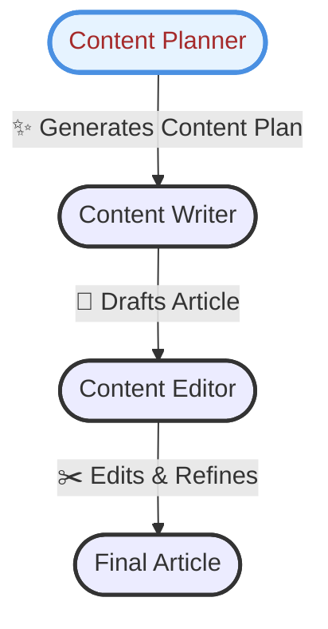

# AI Agent Article Writer

To Execute the code, read the main README.md file of the GitHub repository.

## Agents Workflow

```mermaid
flowchart TD
    A([Content Planner]) -->|"✨ Generates Content Plan"| B([Content Writer])
    B -->|"📝 Drafts Article"| C([Content Editor])
    C -->|"✂️ Edits & Refines"| D([Final Article])
   
    classDef default fill:##333300,stroke:#333,stroke-width:2.5px;
    classDef highlight fill:#e6f3ff,stroke:#4a90e2,stroke-width:3px;
   
    class A,B,C,D default;
    class A highlight;
    style A color:brown
```

## Preview of Agentic System
