# CrewAI Projects Collection
Currently working on these and will be finshing all of them after admission in lums.

# README of the first I worked on
# AI Agent Article Writer

To Execute the code, read the main README.md file of the GitHub repository.

## Agents Workflow

```mermaid
flowchart LR
    A{{📚 Researcher Agent}} --> B{{🖊️ Writer Agent}}
    B -->C{{✂️ Editor Agent}}
    C --> D@{ shape: delay, label: "📃 Final Article" }
    
    classDef default fill:##333300,stroke:#333,stroke-width:2.5px;
    classDef highlight fill:#333300,stroke:#4a90e2,stroke-width:3px;
    classDef large font-size:30px

    class A,B,C,D default;
    class D highlight;
```

## Preview of Agentic System

